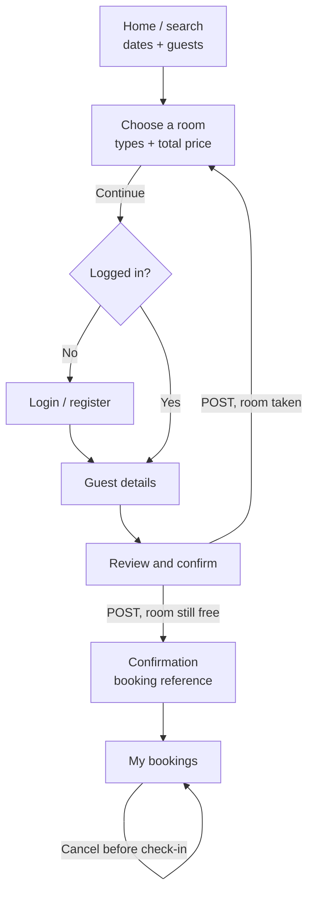
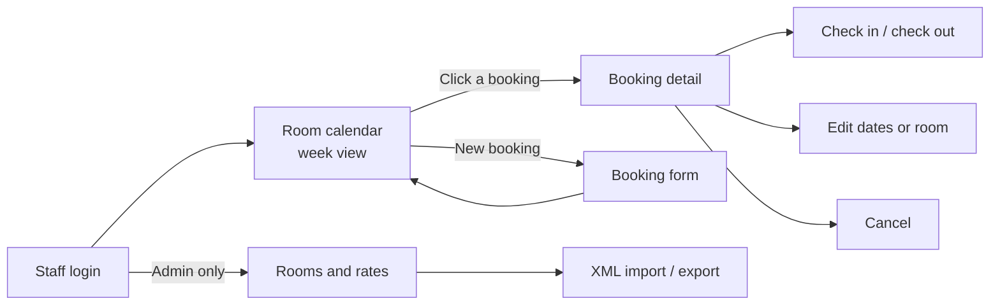
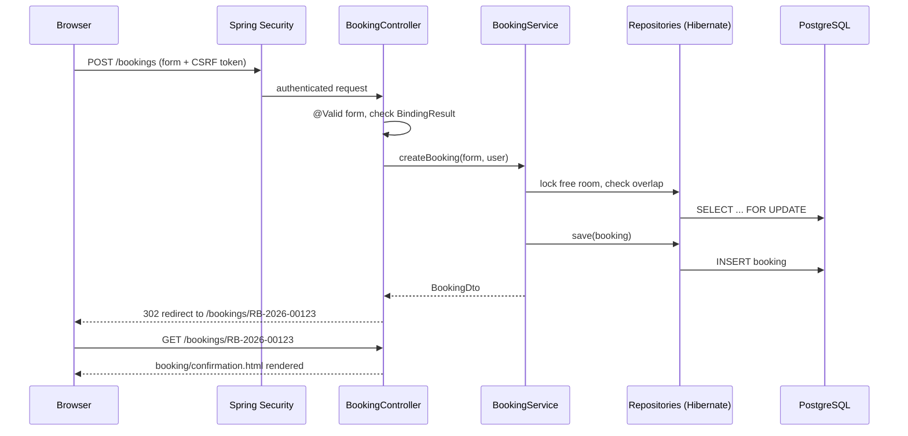
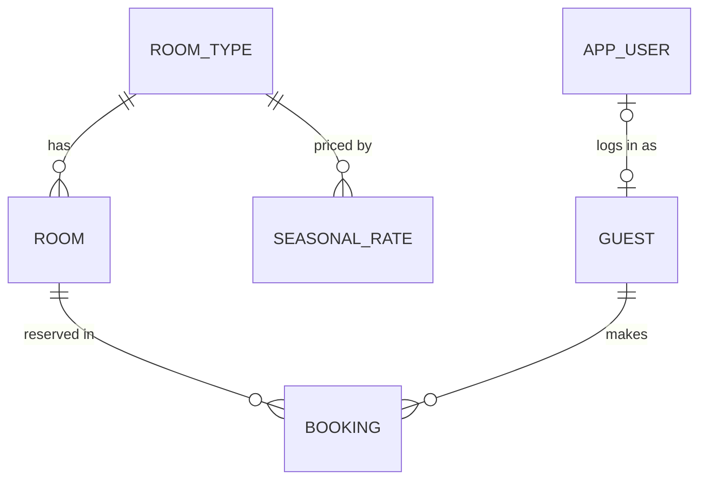

# Resort Booking — App Flow, UI Brief & Backend Schema

*2026-09-19 · @Someone*

The web app is server-rendered with Spring MVC and Thymeleaf, uses session-based form login, and stores data through Hibernate in PostgreSQL. The `/api/v1` REST endpoints from the [TRD](prd-trd.md) stay available with JWT; the Thymeleaf pages call the same service layer directly.

## App flow

### Guest booking flow



The selected dates, room type and guest count travel as query parameters until the confirm step, so a refresh or back button never loses them. If another guest takes the last room first, the guest returns to the room list with a message.

### Staff flow



Every staff action returns to the calendar or booking detail with a success or error message.

### Request lifecycle



Every form POST ends in a redirect (Post/Redirect/Get), so refreshing the confirmation page never creates a second booking.

## UI design brief

Guest pages follow direction B (clean utility): mobile-first, dense, fast to scan. Staff pages follow the room calendar design: desktop-first with a dark sidebar. Both share one stylesheet, `static/css/app.css`, built on the tokens below.

### Design tokens

| Token | Value | Use |
|---|---|---|
| `--font` | IBM Plex Sans, system-ui, sans-serif | All text |
| `--font-mono` | IBM Plex Mono, monospace | Booking references, room numbers |
| `--bg` | #F4F5F7 | Page background |
| `--surface` | #FFFFFF | Cards, forms, top bar |
| `--ink` | #16181D | Main text |
| `--muted` | #5B6270 | Labels, secondary text |
| `--border` | #E1E4EA | Card and input borders |
| `--primary` | #1B4DB1 | Buttons, links, selected radio |
| `--primary-soft` | #EEF3FC | Selected row background |
| `--sidebar` | #1C2421 | Staff navigation |
| `--danger` | #B42318 | Errors, cancel actions |
| `--radius` | 12px cards, 8px inputs and buttons | Corners |
| Spacing | 4, 8, 12, 16, 24, 32 px | All gaps and padding |
| Touch target | 44 px minimum height | Buttons, inputs, list rows |

**Booking status colours** (calendar bars and status chips):

| Status | Background | Text |
|---|---|---|
| PENDING | #F3DFB9 | #5A3806 |
| CONFIRMED | #CFE5DF | #0B3F3A |
| CHECKED_IN | #D5DCF0 | #1E2F5C |
| CHECKED_OUT | #E4E5E1 | #3E4743 |
| CANCELLED | #F6D6D3 | #7A1F16 |

## Layouts and shared fragments

| Fragment | File | Contents |
|---|---|---|
| Guest layout | `layout/guest.html` | Top bar (logo, My bookings, login/logout), flash message area, `main` slot |
| Staff layout | `layout/staff.html` | 232 px sidebar (Room calendar, Bookings, Rooms, Guests, Rates), page header slot, flash messages |
| Flash message | `fragments/alert.html` | Success or error banner from `RedirectAttributes` |
| Form field | `fragments/form.html :: field(name, label, type)` | Label, input, inline error from `BindingResult` |
| Status chip | `fragments/status.html :: chip(status)` | Coloured pill using the status table above |
| Pagination | `fragments/pager.html :: pager(page)` | Previous / next and page numbers for Spring Data `Page` |

### Page inventory

| Page | URL (GET) | Template | Controller | Model attributes | Form POST |
|---|---|---|---|---|---|
| Search | `/` | `guest/search.html` | HomeController | `searchForm` | GET to `/rooms` |
| Choose a room | `/rooms?checkIn&checkOut&guests&type` | `guest/rooms.html` | AvailabilityController | `searchForm`, `options` (room type, capacity, nights, total), `nights` | GET to `/book` |
| Guest details | `/book?typeId&checkIn&checkOut&guests` | `guest/details.html` | BookingController | `bookingForm`, `quote` | POST `/book/review` |
| Review and confirm | `/book/review` | `guest/review.html` | BookingController | `bookingForm`, `quote` | POST `/bookings` |
| Confirmation | `/bookings/{ref}` | `guest/confirmation.html` | BookingController | `booking` | — |
| My bookings | `/me/bookings` | `guest/mybookings.html` | MyBookingsController | `bookings` (Page) | POST `/bookings/{ref}/cancel` |
| Login | `/login` | `auth/login.html` | AuthController | `error`, `logout` flags | POST `/login` (Spring Security) |
| Register | `/register` | `auth/register.html` | AuthController | `registerForm` | POST `/register` |
| Room calendar | `/staff/calendar?week` | `staff/calendar.html` | CalendarController | `days` (7 dates), `rows` (room + bookings with column start and span), `week` | — |
| Booking detail | `/staff/bookings/{ref}` | `staff/booking-detail.html` | StaffBookingController | `booking`, `allowedActions` | POST check-in, check-out, cancel |
| Booking form | `/staff/bookings/new`, `/{ref}/edit` | `staff/booking-form.html` | StaffBookingController | `bookingForm`, `roomTypes`, `rooms` | POST `/staff/bookings` |
| Bookings search | `/staff/bookings?q&status&page` | `staff/bookings.html` | StaffBookingController | `bookings` (Page), `q`, `status` | — |
| Rooms and types | `/admin/rooms` | `admin/rooms.html` | RoomAdminController | `roomTypes`, `rooms`, `roomTypeForm` | POST `/admin/room-types`, `/admin/rooms` |
| Rates | `/admin/rates` | `admin/rates.html` | RateAdminController | `rates`, `rateForm` | POST `/admin/rates`, `/admin/rates/import` (multipart XML) |

**Calendar rendering tip:** compute each booking bar's grid column and span in the controller (e.g. `startCol = 2 + daysBetween(weekStart, checkIn)`, clipped to the week) and pass them in the model; the template only loops and writes `th:style="|grid-column: ${bar.startCol} / span ${bar.span}|"`. Keep date math out of templates.

## Thymeleaf conventions

Add three dependencies to the existing project: `spring-boot-starter-thymeleaf`, `spring-boot-starter-security` and `thymeleaf-extras-springsecurity6`. Controllers for pages use `@Controller` and return a template name; REST controllers keep `@RestController`.

### Project folders

```
src/main/resources/
├── templates/
│   ├── layout/      guest.html, staff.html
│   ├── fragments/   alert.html, form.html, status.html, pager.html
│   ├── guest/       search, rooms, details, review, confirmation, my-bookings
│   ├── staff/       calendar, bookings, booking-detail, booking-form
│   ├── admin/       rooms, rates
│   └── auth/        login, register
├── static/css/app.css
└── db/migration/    V1__init.sql, V2__seed.sql
```

### Forms and validation

Each form binds to a form object (a class with a no-arg constructor and setters, not the entity). The controller re-renders the same page when validation fails and redirects when it succeeds.

```java
@PostMapping("/bookings")
public String create(@Valid @ModelAttribute("bookingForm") BookingForm form,
                      BindingResult result, Principal principal,
                      Model model, RedirectAttributes flash) {
    if (result.hasErrors()) {
        model.addAttribute("quote", pricingService.quote(form));
        return "guest/review";
    }
    try {
        BookingDto booking = bookingService.create(form, principal.getName());
        flash.addFlashAttribute("success", "Booking confirmed");
        return "redirect:/bookings/" + booking.reference();
    } catch (RoomNotAvailableException e) {
        flash.addFlashAttribute("error", "That room was just booked. Please choose another.");
        return "redirect:/rooms?" + form.searchQuery();
    }
}
```

```html
<form th:action="@{/bookings}" th:object="${bookingForm}" method="post">
  <label for="fullName">Full name</label>
  <input id="fullName" th:field="*{fullName}" type="text">
  <p class="field-error" th:if="${#fields.hasErrors('fullName')}"
     th:errors="*{fullName}"></p>
  <input type="hidden" th:field="*{roomTypeId}">
  <button type="submit" class="btn-primary">Confirm booking</button>
</form>
```

`th:action` adds the CSRF token automatically; never build form URLs by hand.

### Rules

- Templates never receive entities; controllers pass DTOs or form objects. This avoids `LazyInitializationException` and leaking fields such as password hashes.
- Set `spring.jpa.open-in-view=false`. All data a page needs is loaded inside the service transaction.
- Format money with `${#numbers.formatDecimal(total, 1, 'COMMA', 2, 'POINT')}` prefixed by ₱; format dates with `${#temporals.format(date, 'MMM d, yyyy')}`.
- Show or hide by role with `sec:authorize="hasRole('ADMIN')"`; always enforce the same rule in `SecurityFilterChain` or the service too.
- Messages and labels live in `messages.properties` (`#{booking.confirm}`) so wording changes need no template edits.
- Status-changing actions (cancel, check-in, check-out) are POST forms, never GET links.

### Security for pages

```java
http
  .authorizeHttpRequests(a -> a
      .requestMatchers("/", "/rooms", "/login", "/register", "/css/**").permitAll()
      .requestMatchers("/staff/**").hasAnyRole("FRONT_DESK", "ADMIN")
      .requestMatchers("/admin/**").hasRole("ADMIN")
      .anyRequest().authenticated())
  .formLogin(f -> f.loginPage("/login").defaultSuccessUrl("/", false))
  .logout(l -> l.logoutSuccessUrl("/"));
```

`defaultSuccessUrl("/", false)` sends a guest back to the booking step they were on after logging in.

## Hibernate entities

Six entities map one-to-one to the tables in the schema below; every relationship is a lazy `@ManyToOne` owned by the child. Set `spring.jpa.hibernate.ddl-auto=validate` so Hibernate checks the entities against the Flyway schema instead of creating tables. The Lesson 1 `RoomType` enum becomes an entity.

| Entity | Table | Relationships | Notes |
|---|---|---|---|
| RoomType | room_type | — | `BigDecimal basePrice` |
| Room | room | `@ManyToOne(fetch = LAZY) RoomType roomType` | `@Enumerated(STRING) RoomStatus status` |
| SeasonalRate | seasonal_rate | `@ManyToOne(fetch = LAZY) RoomType roomType` | `LocalDate startDate, endDate` |
| AppUser | app_user | — | `Role role`; implements nothing Spring-specific, mapped to `UserDetails` in a service |
| Guest | guest | `@OneToOne(fetch = LAZY) AppUser user` (nullable) | Front desk can book for walk-ins |
| Booking | booking | `@ManyToOne(fetch = LAZY) Guest guest`, `@ManyToOne(fetch = LAZY) Room room` | `@Version`, status transitions inside the entity |

### Booking entity

```java
@Entity
@Table(name = "booking")
public class Booking {

    @Id
    @GeneratedValue(strategy = GenerationType.IDENTITY)
    private Long id;

    @Column(nullable = false, unique = true, length = 20)
    private String reference;

    @ManyToOne(fetch = FetchType.LAZY, optional = false)
    @JoinColumn(name = "guest_id")
    private Guest guest;

    @ManyToOne(fetch = FetchType.LAZY, optional = false)
    @JoinColumn(name = "room_id")
    private Room room;

    @Column(name = "check_in", nullable = false)
    private LocalDate checkIn;

    @Column(name = "check_out", nullable = false)
    private LocalDate checkOut;

    @Column(name = "num_guests", nullable = false)
    private int numGuests;

    @Column(name = "total_price", nullable = false, precision = 10, scale = 2)
    private BigDecimal totalPrice;

    @Enumerated(EnumType.STRING)
    @Column(nullable = false, length = 20)
    private BookingStatus status = BookingStatus.PENDING;

    @Column(name = "created_at", nullable = false, updatable = false)
    private OffsetDateTime createdAt;

    @Version
    private int version;

    protected Booking() {}

    @PrePersist
    void onCreate() { createdAt = OffsetDateTime.now(ZoneId.of("Asia/Manila")); }

    public void confirm()   { transitionTo(BookingStatus.CONFIRMED); }
    public void checkIn()   { transitionTo(BookingStatus.CHECKED_IN); }
    public void checkOut()  { transitionTo(BookingStatus.CHECKED_OUT); }
    public void cancel()    { transitionTo(BookingStatus.CANCELLED); }

    private void transitionTo(BookingStatus next) {
        if (!status.canMoveTo(next)) {
            throw new InvalidStatusTransitionException(status, next);
        }
        status = next;
    }
    // constructor with required fields, getters
}

public enum BookingStatus {
    PENDING, CONFIRMED, CHECKED_IN, CHECKED_OUT, CANCELLED;

    public boolean canMoveTo(BookingStatus next) {
        return switch (this) {
            case PENDING    -> next == CONFIRMED || next == CANCELLED;
            case CONFIRMED  -> next == CHECKED_IN || next == CANCELLED;
            case CHECKED_IN -> next == CHECKED_OUT;
            default         -> false;
        };
    }
}
```

Keeping the transition rule in the enum makes BR-08 unit-testable without Spring or a database.

### Repository queries

```java
public interface RoomRepository extends JpaRepository<Room, Long> {

    // BR-01 + BR-10: free rooms of a type, locked so two requests cannot take the same one
    @Lock(LockModeType.PESSIMISTIC_WRITE)
    @Query("""
        SELECT r FROM Room r
        WHERE r.roomType.id = :typeId
          AND r.status = com.rai.resortbooking.room.RoomStatus.AVAILABLE
          AND NOT EXISTS (
            SELECT b FROM Booking b
            WHERE b.room = r
              AND b.status <> com.rai.resortbooking.booking.BookingStatus.CANCELLED
              AND b.checkIn < :checkOut
              AND b.checkOut > :checkIn)
        ORDER BY r.roomNumber
        """)
    List<Room> findFreeRoomsForUpdate(Long typeId, LocalDate checkIn, LocalDate checkOut);
}

public interface BookingRepository extends JpaRepository<Booking, Long> {

    Optional<Booking> findByReference(String reference);

    // Calendar: one query, no N+1
    @Query("""
        SELECT b FROM Booking b
        JOIN FETCH b.room r JOIN FETCH r.roomType JOIN FETCH b.guest
        WHERE b.status <> com.rai.resortbooking.booking.BookingStatus.CANCELLED
          AND b.checkIn < :weekEnd AND b.checkOut > :weekStart
        """)
    List<Booking> findForCalendar(LocalDate weekStart, LocalDate weekEnd);

    @EntityGraph(attributePaths = {"room", "room.roomType"})
    Page<Booking> findByGuestUserEmail(String email, Pageable pageable);
}
```

Compile with the `-parameters` flag (Spring Boot's Maven plugin does this by default) so named parameters like `:typeId` bind without `@Param`.

## Backend schema

The schema is created by Flyway from `db/migration/V1__init.sql`; constraints enforce the business rules in the database as well as in Java. Add `flyway-core` and `flyway-database-postgresql` to the project and drop the Lesson 1 `rooms` table (or start from an empty database).



### V1__init.sql

```sql
CREATE EXTENSION IF NOT EXISTS btree_gist;

CREATE TABLE room_type (
    id           BIGSERIAL PRIMARY KEY,
    name         VARCHAR(50)    NOT NULL UNIQUE,
    capacity     INT            NOT NULL CHECK (capacity > 0),
    base_price   NUMERIC(10,2)  NOT NULL CHECK (base_price >= 0),
    description  TEXT
);

CREATE TABLE room (
    id             BIGSERIAL PRIMARY KEY,
    room_number    VARCHAR(10) NOT NULL UNIQUE,
    room_type_id   BIGINT      NOT NULL REFERENCES room_type(id),
    status         VARCHAR(20) NOT NULL DEFAULT 'AVAILABLE'
                   CHECK (status IN ('AVAILABLE', 'MAINTENANCE'))
);
CREATE INDEX idx_room_type ON room(room_type_id);

CREATE TABLE seasonal_rate (
    id             BIGSERIAL PRIMARY KEY,
    room_type_id   BIGINT         NOT NULL REFERENCES room_type(id),
    start_date     DATE           NOT NULL,
    end_date       DATE           NOT NULL,
    price          NUMERIC(10,2)  NOT NULL CHECK (price >= 0),
    CHECK (end_date > start_date),
    EXCLUDE USING gist (room_type_id WITH =, daterange(start_date, end_date) WITH &&)
);

CREATE TABLE app_user (
    id              BIGSERIAL PRIMARY KEY,
    email           VARCHAR(150) NOT NULL UNIQUE,
    password_hash   VARCHAR(100) NOT NULL,
    role            VARCHAR(20)  NOT NULL CHECK (role IN ('GUEST', 'FRONT_DESK', 'ADMIN')),
    enabled         BOOLEAN      NOT NULL DEFAULT TRUE
);

CREATE TABLE guest (
    id          BIGSERIAL PRIMARY KEY,
    full_name   VARCHAR(100) NOT NULL,
    email       VARCHAR(150) NOT NULL UNIQUE,
    phone       VARCHAR(20),
    user_id     BIGINT UNIQUE REFERENCES app_user(id)
);

CREATE TABLE booking (
    id            BIGSERIAL PRIMARY KEY,
    reference     VARCHAR(20)    NOT NULL UNIQUE,
    guest_id      BIGINT         NOT NULL REFERENCES guest(id),
    room_id       BIGINT         NOT NULL REFERENCES room(id),
    check_in      DATE           NOT NULL,
    check_out     DATE           NOT NULL,
    num_guests    INT            NOT NULL CHECK (num_guests > 0),
    total_price   NUMERIC(10,2)  NOT NULL CHECK (total_price >= 0),
    status        VARCHAR(20)    NOT NULL DEFAULT 'PENDING'
                  CHECK (status IN ('PENDING', 'CONFIRMED', 'CHECKED_IN', 'CHECKED_OUT', 'CANCELLED')),
    created_at    TIMESTAMPTZ    NOT NULL DEFAULT now(),
    version       INT            NOT NULL DEFAULT 0,
    CHECK (check_out > check_in),
    CONSTRAINT no_overlap EXCLUDE USING gist (
        room_id WITH =, daterange(check_in, check_out) WITH &&
    ) WHERE (status <> 'CANCELLED')
);
CREATE INDEX idx_booking_room_dates ON booking(room_id, check_in, check_out);
CREATE INDEX idx_booking_guest ON booking(guest_id);
CREATE INDEX idx_booking_status ON booking(status);

CREATE SEQUENCE booking_ref_seq START 1;
```

`daterange(check_in, check_out)` excludes the end date by default, which matches BR-02: a check-out on Oct 14 and a check-in on Oct 14 do not overlap. The seasonal rate exclusion stops two rates covering the same night for one room type, so pricing is never ambiguous.

The service builds references as `'RB-' + year + '-' + lpad(nextval('booking_ref_seq'), 5, '0')`, giving `RB-2026-00001`.

### V2__seed.sql (sample data)

```sql
INSERT INTO room_type (name, capacity, base_price) VALUES
  ('Standard', 2, 2500.00),
  ('Deluxe',   3, 3500.00),
  ('Family',   4, 4500.00),
  ('Villa',    4, 8000.00);

INSERT INTO room (room_number, room_type_id) VALUES
  ('101', 1), ('102', 1),
  ('201', 2), ('202', 2),
  ('301', 3),
  ('V1',  4);
```

The prices are sample values for development only. Create the first admin account with a `CommandLineRunner` that reads the email and password from environment variables and hashes the password with BCrypt; never commit a password or hash to a migration.
