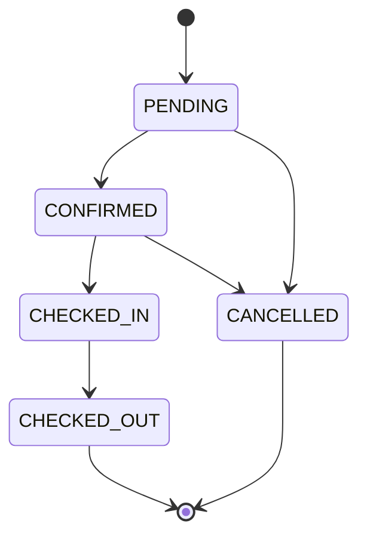
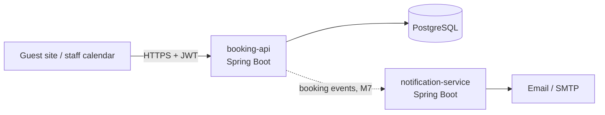
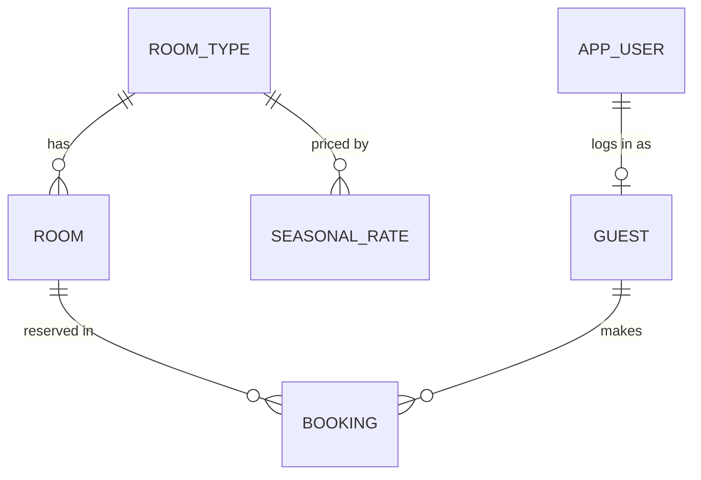

# Resort Booking System — PRD & TRD

*2026-09-19 · @Someone*

## Part 1 — Product Requirements (PRD)

### Overview

The Resort Booking System lets guests book rooms at a small Philippine resort online and gives front desk staff one calendar to manage every reservation. It replaces bookings taken by Messenger, phone and paper logbook, where double-bookings and lost reservations happen.

It is also a portfolio project: each feature is chosen to demonstrate Java, Spring Boot, Hibernate, REST, PostgreSQL, testing and Agile practice.

### Problem

- Owners track availability by hand, so two guests can be promised the same room on the same night.
- Guests cannot see real-time availability or prices and must wait for a reply.
- Rate changes (holidays, peak season) are applied inconsistently.
- There is no single record of who is arriving, staying or leaving on a given day.

### Goals

1. Guests can search availability by date and guest count and book a room without contacting staff.
2. The system makes a double-booking of the same room on overlapping nights impossible.
3. Staff see all rooms and bookings for a week on one calendar and can create, change and cancel bookings.
4. Prices follow base rates and seasonal overrides automatically, and a booking keeps the price the guest agreed to.

### Non-goals (v1)

- Online payment processing; payment is recorded manually by staff.
- Channel manager sync with OTAs (Agoda, Booking.com).
- Multi-property or multi-branch support.
- BIR receipt or official invoice generation.
- Native mobile apps; the guest site is mobile-responsive web.

### Users and roles

Three roles, each with its own permissions; a guest sees only their own bookings.

| Role | Who | Can do |
|---|---|---|
| Guest | Traveler booking a stay | Search availability, book, view and cancel own bookings, update own profile |
| Front Desk | Resort staff on shift | Everything a guest can do for any guest; view room calendar; check guests in and out; record manual payments; block a room for maintenance |
| Admin | Resort owner or manager | Everything Front Desk can do; manage room types, rooms, base prices and seasonal rates; manage staff accounts; view reports |

### Functional requirements

Requirements are grouped by feature; each carries an ID used by the API spec and test cases. Priority: P1 = MVP, P2 = after MVP.

| ID | User story | Priority |
|---|---|---|
| FR-01 | As a guest, I can search available rooms by check-in, check-out and guest count, filtered by room type | P1 |
| FR-02 | As a guest, I see the total price for my dates before booking | P1 |
| FR-03 | As a guest, I can book an available room and receive a booking reference (e.g. RB-2026-00123) | P1 |
| FR-04 | As a guest, I can view my bookings and cancel one before check-in | P1 |
| FR-05 | As a guest, I can register and log in with email and password | P1 |
| FR-06 | As front desk, I can view a weekly room calendar showing every booking by status | P1 |
| FR-07 | As front desk, I can create, edit and cancel a booking for any guest | P1 |
| FR-08 | As front desk, I can check a guest in and out | P1 |
| FR-09 | As front desk, I can search bookings by reference or guest name | P1 |
| FR-10 | As admin, I can create and edit room types (name, capacity, base price) and rooms (number, type, status) | P1 |
| FR-11 | As admin, I can add seasonal rates that override the base price for a date range | P2 |
| FR-12 | As admin, I can import and export room rates as an XML file | P2 |
| FR-13 | As a guest, I receive an email when my booking is confirmed or cancelled | P2 |
| FR-14 | As front desk, I can mark a room as under maintenance so it cannot be booked | P2 |
| FR-15 | As admin, I can view occupancy and revenue for a date range | P2 |

### Business rules

The no-double-booking rule (BR-01) is the core of the system; every other rule protects pricing or data integrity.

| ID | Rule |
|---|---|
| BR-01 | A room cannot have two active bookings whose dates overlap. Two stays overlap when existing check-in < new check-out AND existing check-out > new check-in. Cancelled bookings are ignored. |
| BR-02 | Check-out date is exclusive: a stay from Oct 12 to Oct 14 is 2 nights, and another guest may check in on Oct 14. |
| BR-03 | Check-in must be today or later; check-out must be after check-in; a stay is at most 30 nights. |
| BR-04 | Guest count cannot exceed the room type's capacity. |
| BR-05 | Nightly price = the seasonal rate covering that night, else the room type's base price. Total = sum of nightly prices. |
| BR-06 | A booking stores its total price at the time of booking; later rate changes do not alter it. |
| BR-07 | Money is stored and calculated as decimal with 2 places in Philippine pesos (PHP); never floating point. |
| BR-08 | Booking status moves PENDING → CONFIRMED → CHECKED_IN → CHECKED_OUT, or to CANCELLED from PENDING or CONFIRMED. No other transitions. |
| BR-09 | A guest may cancel only their own booking and only before check-in. |
| BR-10 | A room under maintenance does not appear in availability and cannot be booked. |
| BR-11 | Booking references are unique, human-readable and never reveal database IDs. |

Booking status state machine (the only allowed transitions per BR-08):



### Screens

The guest site follows direction B (clean utility) and staff use the room calendar, both from the design canvas.

| Screen | User | Purpose | Requirements |
|---|---|---|---|
| Search | Guest | Pick dates and guest count | FR-01 |
| Choose a room | Guest | Compare room types, see total, continue | FR-01, FR-02 |
| Guest details and confirm | Guest | Enter contact details, confirm booking, show reference | FR-03 |
| My bookings | Guest | View and cancel bookings | FR-04 |
| Login / register | Guest, staff | Sign in | FR-05 |
| Room calendar | Front Desk | Weekly view of all rooms and bookings | FR-06, FR-08, FR-09 |
| Booking form | Front Desk | Create or edit a booking | FR-07 |
| Rooms and rates | Admin | Manage room types, rooms, seasonal rates, XML import | FR-10, FR-11, FR-12 |

### Non-functional requirements

| ID | Area | Requirement |
|---|---|---|
| NFR-01 | Performance | Availability search returns in under 500 ms at p95 with 50 rooms and 10,000 bookings |
| NFR-02 | Concurrency | Two simultaneous requests for the same room and dates produce exactly one booking |
| NFR-03 | Security | Passwords hashed with BCrypt; every endpoint except search and login requires a valid token; role checks on every staff and admin action |
| NFR-04 | Usability | Guest pages work on a 390 px wide phone screen; touch targets at least 44 px |
| NFR-05 | Reliability | Every schema change is a versioned migration; no data loss on redeploy |
| NFR-06 | Quality | At least 80% line coverage on the service layer; all P1 business rules have tests |
| NFR-07 | Time zone | All dates use Asia/Manila |

### Success criteria

- Zero double-bookings in the concurrency test (NFR-02) across 100 parallel attempts.
- All P1 requirements pass their acceptance tests.
- A guest can go from search to booking reference in under 2 minutes.
- The project is public on GitHub with a README, API docs and one-command local setup.

### Open questions

- [ ] Should guest bookings start as PENDING until staff confirm, or be CONFIRMED immediately?
- [ ] What cancellation policy applies: free cancellation until a cutoff, or none?
- [ ] Is the frontend built with Thymeleaf (server-rendered) or React.js?
- [ ] Is a deposit or down payment required to confirm a booking?

> **Resolved (see [App Flow, UI Brief & Backend Schema](app-flow-ui-backend.md)):** the frontend is server-rendered with Spring MVC and Thymeleaf, using session-based form login, while the `/api/v1` REST endpoints below stay available with JWT.

---

## Part 2 — Technical Requirements (TRD)

### Architecture

v1 is a single Spring Boot application (modular monolith) backed by PostgreSQL, organised by feature with controller → service → repository layers inside each. Notifications are split into a second service in a later milestone to demonstrate microservices.



Solid lines are v1; the dotted line is the later microservices split.

**Package layout** (package-by-feature):

```
com.rai.resortbooking
├── room/       RoomType, Room, controllers, services, repositories, DTOs
├── rate/       SeasonalRate, pricing service, XML import/export
├── guest/      Guest, registration
├── booking/    Booking, availability, status transitions
├── auth/       security config, JWT filter, login
└── common/     error handling, base entities, utilities
```

Each request flows Controller (validates the DTO) → Service (business rules, `@Transactional`) → Repository (Spring Data JPA). Entities never leave the service layer; controllers return DTOs.

### Tech stack

| Layer | Choice | Why |
|---|---|---|
| Language | Java 21 | Current LTS; records for DTOs |
| Framework | Spring Boot 3.x (latest stable) | Auto-configuration, embedded Tomcat |
| Web | Spring Web (REST) | RESTful JSON API |
| Persistence | Spring Data JPA / Hibernate | ORM, derived and JPQL queries |
| Database | PostgreSQL 16 | Matches the target job; strong date and locking support |
| Migrations | Flyway | Versioned schema changes (replaces `ddl-auto=update` after Lesson 1) |
| Security | Spring Security + JWT | Stateless auth, role-based access |
| Validation | Jakarta Bean Validation | `@NotNull`, `@Future`, custom date-range checks |
| XML | Jackson XML (`jackson-dataformat-xml`) | Rate import/export |
| API docs | springdoc-openapi (Swagger UI) | Live endpoint documentation |
| Testing | JUnit 5, Mockito, Spring Boot Test, Testcontainers | Unit and integration (SIT) tests on real PostgreSQL |
| Build | Maven | Standard in enterprise Java teams |
| Runtime | Docker + Docker Compose | One-command local setup |
| Source control | Git + GitHub | Public portfolio |

### Data model

Six tables follow Option B (room types with seasonal rates); a booking reserves one physical room.



| Table | Key columns | Constraints and indexes |
|---|---|---|
| room_type | id BIGSERIAL PK, name VARCHAR(50), capacity INT, base_price NUMERIC(10,2), description TEXT | name UNIQUE; capacity > 0; base_price >= 0 |
| room | id PK, room_number VARCHAR(10), room_type_id FK, status VARCHAR(20) | room_number UNIQUE; status IN (AVAILABLE, MAINTENANCE) |
| seasonal_rate | id PK, room_type_id FK, start_date DATE, end_date DATE, price NUMERIC(10,2) | end_date > start_date; index (room_type_id, start_date, end_date) |
| guest | id PK, full_name VARCHAR(100), email VARCHAR(150), phone VARCHAR(20), user_id FK NULL | email UNIQUE |
| booking | id PK, reference VARCHAR(20), guest_id FK, room_id FK, check_in DATE, check_out DATE, num_guests INT, total_price NUMERIC(10,2), status VARCHAR(20), created_at TIMESTAMPTZ, version INT | reference UNIQUE; check_out > check_in; index (room_id, check_in, check_out) |
| app_user | id PK, email VARCHAR(150), password_hash VARCHAR(100), role VARCHAR(20), enabled BOOLEAN | email UNIQUE; role IN (GUEST, FRONT_DESK, ADMIN) |

**JPA mapping notes**

- `Room → RoomType`: `@ManyToOne(fetch = LAZY)`; `Booking → Room` and `Guest`: `@ManyToOne(fetch = LAZY)`. Avoid `@OneToMany` collections unless a screen needs them, to prevent N+1 queries.
- Money fields are `BigDecimal`; dates are `LocalDate`; `created_at` is `OffsetDateTime`.
- Enums map with `@Enumerated(EnumType.STRING)`.
- `booking.version` is a `@Version` column for optimistic locking on edits.
- Guests can book without an account (front desk bookings), so `guest.user_id` is nullable.

### REST API

All endpoints live under `/api/v1`, exchange JSON (XML only for rate import/export) and return standard HTTP status codes; list endpoints are paginated with `?page=&size=`.

| Method | Path | Role | Purpose | Success |
|---|---|---|---|---|
| POST | `/auth/register` | Public | Create guest account | 201 |
| POST | `/auth/login` | Public | Return JWT | 200 |
| GET | `/availability?checkIn=&checkOut=&guests=&type=` | Public | Available room types with total price (FR-01, FR-02) | 200 |
| POST | `/bookings` | Guest, Front Desk | Create booking (FR-03, FR-07) | 201 |
| GET | `/bookings/me` | Guest | Own bookings (FR-04) | 200 |
| GET | `/bookings?from=&to=&q=&status=` | Front Desk | Search and calendar data (FR-06, FR-09) | 200 |
| GET | `/bookings/{reference}` | Owner, Front Desk | One booking | 200 |
| PATCH | `/bookings/{reference}` | Front Desk | Change dates, room or guest count | 200 |
| POST | `/bookings/{reference}/cancel` | Owner, Front Desk | Cancel (BR-09) | 200 |
| POST | `/bookings/{reference}/check-in` | Front Desk | Status to CHECKED_IN | 200 |
| POST | `/bookings/{reference}/check-out` | Front Desk | Status to CHECKED_OUT | 200 |
| GET, POST | `/room-types` | Public read, Admin write | List or create room types (FR-10) | 200, 201 |
| PUT | `/room-types/{id}` | Admin | Update room type | 200 |
| GET, POST | `/rooms` | Front Desk read, Admin write | List or create rooms | 200, 201 |
| PATCH | `/rooms/{id}/status` | Front Desk | Set AVAILABLE or MAINTENANCE (FR-14) | 200 |
| GET, POST | `/rates` | Admin | List or add seasonal rates (FR-11) | 200, 201 |
| POST | `/rates/import` | Admin | Import rates from XML (FR-12) | 200 |
| GET | `/rates/export` | Admin | Export rates as XML (FR-12) | 200 |

**Example: create a booking**

```
POST /api/v1/bookings
{
  "roomTypeId": 2,
  "checkIn": "2026-10-12",
  "checkOut": "2026-10-14",
  "numGuests": 2,
  "guest": { "fullName": "Juan Dela Cruz", "email": "juan@example.com", "phone": "09171234567" }
}
```

```
201 Created
{
  "reference": "RB-2026-00123",
  "roomNumber": "201",
  "roomType": "Deluxe",
  "checkIn": "2026-10-12",
  "checkOut": "2026-10-14",
  "nights": 2,
  "totalPrice": "7000.00",
  "currency": "PHP",
  "status": "PENDING"
}
```

The guest picks a room type; the service assigns the first free room of that type. Prices are sent as strings so no client parses money as a float.

**Example: availability query**

```sql
SELECT r.* FROM room r
WHERE r.room_type_id = :typeId
  AND r.status = 'AVAILABLE'
  AND NOT EXISTS (
    SELECT 1 FROM booking b
    WHERE b.room_id = r.id
      AND b.status <> 'CANCELLED'
      AND b.check_in < :checkOut
      AND b.check_out > :checkIn)
```

This is BR-01 as SQL; it becomes a JPQL `@Query` on `RoomRepository`.

### Security

Authentication is stateless JWT; authorization is role-based with an ownership check for guest resources.

- Login returns an access token (HS256, 1-hour expiry) carrying the user id and role. The client sends `Authorization: Bearer <token>`.
- A `OncePerRequestFilter` validates the token and sets the `SecurityContext`; sessions are disabled (`SessionCreationPolicy.STATELESS`).
- URL rules in `SecurityFilterChain` plus `@PreAuthorize("hasRole('ADMIN')")` on admin service methods.
- Ownership: a guest requesting `/bookings/{reference}` that is not theirs gets 404, not 403, so references cannot be probed.
- Passwords: BCrypt. The JWT secret comes from an environment variable, never from source control.
- CORS allows only the frontend origin.

### Validation

- Request DTOs are Java records annotated with Bean Validation: `@NotNull`, `@Email`, `@Positive`, `@FutureOrPresent`.
- A custom `@ValidDateRange` class-level constraint enforces check-out after check-in and at most 30 nights (BR-03).
- Business rules that need the database (BR-01, BR-04, BR-10) are checked in the service layer inside the transaction.

### Concurrency

Two guests booking the last free room at the same moment must not both succeed (NFR-02). The booking service locks candidate rooms with `SELECT … FOR UPDATE` (`@Lock(PESSIMISTIC_WRITE)`) before running the overlap check, inside one `@Transactional` method. As a database-level backstop, a PostgreSQL exclusion constraint rejects overlapping active bookings on the same room:

```sql
CREATE EXTENSION IF NOT EXISTS btree_gist;
ALTER TABLE booking ADD CONSTRAINT no_overlap
  EXCLUDE USING gist (room_id WITH =, daterange(check_in, check_out) WITH &&)
  WHERE (status <> 'CANCELLED');
```

### Error handling

A `@RestControllerAdvice` maps exceptions to one JSON error shape (RFC 7807 `ProblemDetail`):

```json
{
  "type": "about:blank",
  "title": "Room not available",
  "status": 409,
  "detail": "No Deluxe room is free from 2026-10-12 to 2026-10-14",
  "code": "ROOM_NOT_AVAILABLE"
}
```

| Exception | Status | When |
|---|---|---|
| MethodArgumentNotValidException | 400 | DTO validation fails; response lists each field error |
| BadCredentialsException | 401 | Wrong email or password |
| AccessDeniedException | 403 | Role not allowed |
| ResourceNotFoundException | 404 | Unknown reference or id, or not the owner |
| RoomNotAvailableException | 409 | Overlap (BR-01) or maintenance (BR-10) |
| InvalidStatusTransitionException | 409 | Transition not allowed by BR-08 |
| CapacityExceededException | 422 | Too many guests for the room type (BR-04) |
| Any other exception | 500 | Logged with a correlation id; generic message to the client |

### Testing strategy

Every P1 business rule has at least one unit test and one integration test against a real PostgreSQL database.

| Level | Tools | Covers |
|---|---|---|
| Unit | JUnit 5, Mockito | Services with mocked repositories: pricing (BR-05, BR-06), status transitions (BR-08), date rules (BR-02, BR-03) |
| Repository | `@DataJpaTest` + Testcontainers PostgreSQL | Overlap query (BR-01), exclusion constraint, custom JPQL |
| API / SIT | `@SpringBootTest` + MockMvc + Testcontainers | Full request → database flows, security rules per role, error responses |
| Concurrency | `ExecutorService` with 100 parallel booking requests | NFR-02: exactly one booking succeeds |
| Performance | Gatling or k6 against Docker Compose | NFR-01: availability p95 under 500 ms |

**Key test cases**

| ID | Case | Expected |
|---|---|---|
| TC-01 | Book room 201 Oct 12–14, then book it Oct 13–15 | Second request 409 ROOM_NOT_AVAILABLE |
| TC-02 | Book Oct 12–14, then Oct 14–16 on the same room | Both succeed (BR-02) |
| TC-03 | Cancel a booking, then book the same dates | Succeeds |
| TC-04 | 3 guests for a Standard room (capacity 2) | 422 |
| TC-05 | Seasonal rate covers Oct 13 only; book Oct 12–14 | Total = base price + seasonal price |
| TC-06 | Guest reads another guest's booking | 404 |
| TC-07 | Check in a CANCELLED booking | 409 |
| TC-08 | Check-out before check-in | 400 with field error |

### Performance

- Index `booking(room_id, check_in, check_out)` for the overlap check.
- Paginate every list endpoint; the calendar fetches one week at a time.
- Use `JOIN FETCH` or DTO projections for the calendar query to avoid N+1 selects; verify with Hibernate statistics before and after.
- Cache room types (`@Cacheable`), which change rarely.

### XML rate import and export

FR-12 uses Jackson XML to map this format to Java records; import validates every row and saves all or nothing in one transaction.

```xml
<rates>
  <rate roomType="Deluxe" startDate="2026-12-20" endDate="2027-01-03" price="4500.00"/>
  <rate roomType="Villa" startDate="2026-12-20" endDate="2027-01-03" price="9800.00"/>
</rates>
```

### Microservices split

In milestone M7, email notifications (FR-13) move to `notification-service`. On booking confirmation or cancellation, `booking-api` calls `POST /notifications` over REST (later replaceable by a message queue such as RabbitMQ). A notification failure is logged and retried; it never rolls back the booking.

### Deployment

- `Dockerfile` (multi-stage: Maven build, then JRE 21 runtime) and `docker-compose.yml` with the app and PostgreSQL.
- Configuration through Spring profiles (`dev`, `test`, `prod`) and environment variables; no secrets in Git.
- GitHub Actions runs `mvn verify` (all tests, Testcontainers included) on every push.

### Milestones

| # | Milestone | Delivers | Job requirement shown |
|---|---|---|---|
| M1 | Spec and setup | This PRD/TRD, Spring Boot project, PostgreSQL, first entity | Requirements, specifications |
| M2 | Core entities and CRUD | Room types, rooms, guests; Flyway migrations | Spring Boot, Hibernate, REST, PostgreSQL |
| M3 | Bookings and availability | Overlap rule, pricing, status transitions, error handling | OOP, problem solving |
| M4 | Security | JWT login, roles, ownership checks | Spring Security |
| M5 | Testing | Unit, repository and SIT suites; concurrency test | Unit and SIT testing |
| M6 | Rates and XML | Seasonal rates, XML import/export | XML, JSON |
| M7 | Microservices | notification-service | Microservices |
| M8 | Performance and ship | Indexes, N+1 fixes, load test, Docker, CI, README | Performance optimization, Git |
